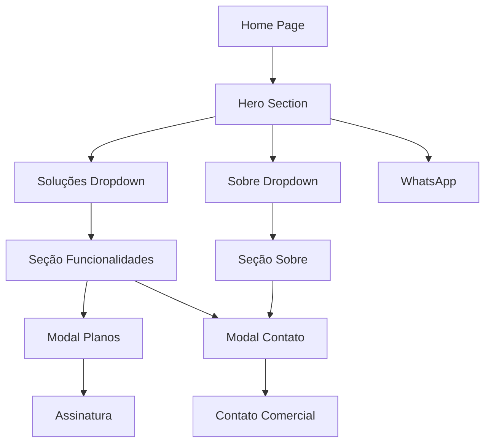

## 1. Visão Geral do Produto

O PlannerSystem Site é a página institucional da plataforma de gestão de eventos, localizada em [www.plannersystem.com.br](http://www.plannersystem.com.br). O site apresenta o ecossistema completo de gestão de eventos corporativos, substituindo planilhas por controle total em uma única plataforma SaaS.

**Problema resolvido:** Eliminar o caos operacional e trazer eficiência real para equipes e finanças de eventos.
**Público-alvo:** Empresas de eventos corporativos, produtores de eventos, empresas de tecnologia e organizações que gerenciam múltiplos eventos simultâneos.
**Valor entregue:** Redução de 40% nos custos, 98% de eficiência operacional e ganho de 60% em prodividade.

## 2. Funcionalidades Principais

### 2.1 Páginas e Seções

O site consiste nas seguintes páginas principais:

1. **Home Page:** Hero section com carrossel interativo, navegação superior, seção de clientes, grid de funcionalidades, detalhes dos recursos, depoimentos e estatísticas.
2. **Modal de Planos:** Interface modal exibindo os três planos (Básico, Profissional, Enterprise) com features e preços.
3. **Modal de Contato:** Formulário completo para contato comercial com informações de empresa e mensagem.

### 2.2 Módulos e Funcionalidades

| Página | Módulo                  | Descrição                                                                                   |
| ------ | ----------------------- | ------------------------------------------------------------------------------------------- |
| Home   | Navbar                  | Menu de navegação responsivo com dropdowns para Soluções e Sobre, botões de login e contato |
| Home   | Hero Section            | Título principal com call-to-action, carrossel interativo com previews do sistema           |
| Home   | Seção de Clientes       | Logos de empresas parceiras em formato de strip                                             |
| Home   | Dark Bento Grid         | Grid moderno destacando centralização, equipes e fornecedores                               |
| Home   | Gestão de Talentos      | Seção com cards de funcionários e sistema de gestão unificada                               |
| Home   | Inteligência Financeira | Dashboard com métricas financeiras em tempo real                                            |
| Home   | Depoimentos             | Carrossel de depoimentos com foto e informações dos clientes                                |
| Home   | Estatísticas            | Grid com números de eficiência e resultados                                                 |
| Home   | Footer CTA              | Call-to-action final com gradiente e botão de demonstração                                  |
| Home   | Footer Completo         | Links de navegação, redes sociais e informações legais                                      |
| Global | WhatsApp Floating       | Botão flutuante com chat simulado para desktop e mobile                                     |
| Global | Privacy Widget          | Modal de consentimento de cookies estilo AdOpt                                              |
| Modal  | Planos                  | Interface modal com três planos de assinatura e botão de teste gratuito                     |
| Modal  | Contato                 | Formulário multi-step com informações de contato lateral                                    |

## 3. Fluxo Principal do Usuário

### Fluxo do Visitante

1. Usuário acessa [www.plannersystem.com.br](http://www.plannersystem.com.br)
2. Visualiza hero section com carrossel de funcionalidades
3. Navega pelas seções de soluções e sobre via dropdowns
4. Explora o grid de funcionalidades e depoimentos
5. Clica em "Solicitar demonstração" ou "Falar com vendas"
6. Abre modal de contato e preenche formulário
7. Alternativamente, clica em "Planos" para ver opções de assinatura
8. Pode fechar negócio via WhatsApp ou formulário

## 4. Design de Interface

### 4.1 Estilo Visual

* **Cores primárias:** Azul (#2563eb, #3b82f6) e índigo (#4f46e5)

* **Cores secundárias:** Verde (#10b981), roxo (#8b5cf6), cinza slate (#64748b, #1e293b)

* **Botões:** Estilo arredondado com sombras e hover effects

* **Tipografia:** Font-sans, tamanhos responsivos, tracking-tight para títulos

* **Layout:** Card-based com bordas arredondadas e gradientes

* **Animações:** Transições suaves, hover effects, carrosséis interativos

### 4.2 Elementos de UI por Seção

| Seção       | Elementos Principais                                         |
| ----------- | ------------------------------------------------------------ |
| Navbar      | Logo, menu dropdown, botões CTA, toggle mobile               |
| Hero        | Título gradiente, subtítulo, botões principais, carrossel 3D |
| Bento Grid  | Cards com gradientes, ícones Lucide, hover effects           |
| Depoimentos | Carrossel com transições, fotos de perfil, quote icon        |
| Footer      | Grid de links, logos sociais, CTA integrado                  |
| Modals      | Overlays com blur, formulários com ícones, botões de ação    |

### 4.3 Responsividade

* **Desktop-first:** Design otimizado para telas grandes

* **Mobile-adaptive:** Breakpoints para tablets e smartphones

* **Touch optimization:** Botões maiores em mobile, navegação simplificada

* **Carrossel adaptativo:** Ajusta número de slides visíveis por tamanho

### 4.4 Interações e Estados

* **Hover states:** Botões, cards e links com transições de cor e escala

* **Active states:** Indicadores visuais para elementos clicáveis

* **Loading states:** Animações de pulsação e skeletons

* **Modal transitions:** Fade-in/zoom-in com backdrop blur

* **Scroll effects:** Navbar que muda de estilo ao rolar

