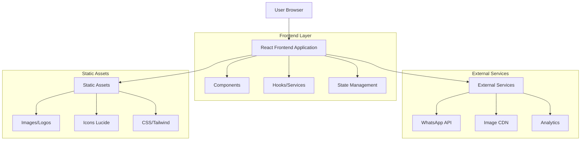

## 1. Arquitetura do Sistema



## 2. Descrição das Tecnologias

- **Frontend:** React@18 + TailwindCSS@3 + Vite
- **Ferramenta de Inicialização:** vite-init
- **Estado Local:** React useState/useEffect
- **Estilização:** TailwindCSS com classes utilitárias
- **Ícones:** Lucide React
- **Backend:** Nenhum (site estático)
- **Deploy:** Vercel/Netlify (sugestão)

## 3. Definições de Rotas

| Rota | Propósito |
|------|-----------|
| / | Home page principal com todas as seções |
| /#funcionalidades | Ancora para seção de funcionalidades |
| /#resultados | Ancora para seção de estatísticas |
| /#sobre | Ancora para seção sobre a empresa |

## 4. Estrutura de Componentes

### 4.1 Componentes Principais

```
src/
├── components/
│   ├── Navbar.jsx
│   ├── HeroSection.jsx
│   ├── Carousel.jsx
│   ├── BentoGrid.jsx
│   ├── Testimonials.jsx
│   ├── Footer.jsx
│   ├── Modals/
│   │   ├── PlansModal.jsx
│   │   ├── ContactModal.jsx
│   │   └── PrivacyModal.jsx
│   └── UI/
│       ├── Button.jsx
│       ├── Card.jsx
│       └── Form.jsx
├── hooks/
│   ├── useScroll.js
│   ├── useCarousel.js
│   └── useModal.js
├── services/
│   ├── whatsapp.js
│   └── analytics.js
└── utils/
    ├── constants.js
    └── helpers.js
```

### 4.2 Tipos de Dados

```typescript
// Testimonial Data
interface Testimonial {
  id: number;
  quote: string;
  author: string;
  role: string;
  company: string;
  image: string;
}

// Plan Data
interface Plan {
  title: string;
  subtitle: string;
  price: string;
  icon: React.ReactNode;
  features: string[];
  popular: boolean;
  color: string;
}

// Slide Data
interface Slide {
  id: number;
  title: string;
  description: string;
  type: 'desktop' | 'mobile';
  gradient: string;
  image: string;
}

// Contact Form Data
interface ContactForm {
  name: string;
  phone: string;
  email: string;
  company: string;
  role: string;
  message?: string;
}
```

## 5. Serviços e Integrações

### 5.1 Serviços Externos
- **WhatsApp Business API:** Para contato via botão flutuante
- **Image CDN:** Unsplash para imagens de placeholder
- **Analytics:** Google Analytics ou similar (sugestão)

### 5.2 Hooks Customizados

```javascript
// useCarousel.js
export const useCarousel = (items, interval = 5000) => {
  const [current, setCurrent] = useState(0);
  
  const next = () => setCurrent((prev) => (prev + 1) % items.length);
  const prev = () => setCurrent((prev) => (prev - 1 + items.length) % items.length);
  
  useEffect(() => {
    const timer = setInterval(next, interval);
    return () => clearInterval(timer);
  }, [current]);
  
  return { current, next, prev };
};

// useModal.js
export const useModal = () => {
  const [isOpen, setIsOpen] = useState(false);
  
  const open = () => setIsOpen(true);
  const close = () => setIsOpen(false);
  const toggle = () => setIsOpen(!isOpen);
  
  return { isOpen, open, close, toggle };
};
```

## 6. Gerenciamento de Estado

### 6.1 Estado Local (useState)
- **Menu mobile:** Aberto/fechado
- **Scroll:** Detecta scroll para navbar
- **Carrossel:** Slide atual ativo
- **Modais:** Estados de abertura para cada modal
- **Privacy widget:** Estado de aceitação de cookies

### 6.2 Constantes e Dados Estáticos

```javascript
// constants.js
export const PLANS_DATA = [
  {
    title: "Básico",
    price: "99,90",
    features: ["Gestão de até 5 eventos/mês", "Folha de pagamento simples"],
    popular: false,
    color: "blue"
  },
  // ... mais planos
];

export const TESTIMONIALS_DATA = [
  {
    quote: "Reduzimos o tempo de fechamento financeiro em 80%",
    author: "Ricardo Mendes",
    role: "Diretor de Operações",
    company: "LAF TECH"
  },
  // ... mais depoimentos
];
```

## 7. Otimizações e Performance

### 7.1 Otimizações de Imagem
- Imagens otimizadas via Unsplash
- Lazy loading para imagens fora da viewport
- WebP format quando possível

### 7.2 Performance
- Code splitting com Vite
- Tree shaking automático
- CSS minificado via Tailwind
- Componentes memoizados quando apropriado

### 7.3 SEO
- Meta tags dinâmicas
- Structured data para rich snippets
- Sitemap.xml gerado
- Robots.txt configurado

## 8. Deploy e Hospedagem

### 8.1 Configuração de Build
```json
{
  "scripts": {
    "dev": "vite",
    "build": "vite build",
    "preview": "vite preview"
  }
}
```

### 8.2 Plataformas Recomendadas
- **Vercel:** Deploy automático com Git
- **Netlify:** Build e deploy contínuo
- **AWS S3 + CloudFront:** Para alta escalabilidade

### 8.3 Variáveis de Ambiente
```env
VITE_WHATSAPP_NUMBER=5511999999999
VITE_ANALYTICS_ID=GA_MEASUREMENT_ID
VITE_API_URL=https://api.plannersystem.com.br
```