# Documentação do Banco de Dados PlannerSystem

## Mermaid ER Diagram

```mermaid
erDiagram
    ABSENCES {
        uuid id PK
        uuid assignment_id FK
        uuid logged_by_id FK
        uuid team_id FK
        date work_date
        text notes
        timestamp created_at
    }

    AUDIT_LOGS {
        uuid id PK
        string action
        string table_name
        uuid record_id
        uuid user_id
        uuid team_id FK
        json old_values
        json new_values
        timestamp created_at
    }

    BACKUP_HISTORY {
        uuid id PK
        string status
        string operation_type
        int file_size
        string created_by
        json records_count
        string[] tables_affected
        string restore_mode
        text error_message
        timestamp created_at
    }

    BACKUP_LOGS {
        int id PK
        timestamp created_at
        string status
        string file_name
        int file_size
        string checksum
        string triggered_by
        string file_key
        string format
        boolean compressed
        json metadata
        string error
        timestamp retention_expires_at
    }

    BACKUP_SETTINGS {
        int id PK
        int retention_days
        string compression
        string format
        string checksum_algorithm
        int max_backups
        string created_by
        timestamp updated_at
    }

    COORDINATOR_EVENT_PERMISSIONS {
        uuid id PK
        uuid coordinator_id
        uuid event_id FK
        uuid team_id FK
        boolean can_view_details
        boolean can_edit
        boolean can_manage_allocations
        boolean can_manage_costs
        boolean can_view_payroll
        uuid granted_by
        timestamp created_at
        timestamp updated_at
    }

    DELETION_LOGS {
        uuid id PK
        string deleted_entity_type
        uuid deleted_entity_id
        string deleted_entity_name
        string deletion_type
        string reason
        uuid deleted_by
        timestamp deleted_at
        json data_summary
    }

    ERROR_REPORTS {
        uuid id PK
        string report_number
        uuid user_id
        uuid team_id FK
        text what_happened
        text what_trying_to_do
        text steps_to_reproduce
        string urgency
        string status
        uuid assigned_to
        text resolution_notes
        timestamp resolved_at
        json technical_data
        string screenshot_url
        json screenshot_annotations
        text admin_notes
        timestamp created_at
        timestamp updated_at
    }

    EVENT_DIVISIONS {
        uuid id PK
        string name
        text description
        uuid event_id FK
        uuid team_id FK
        timestamp created_at
    }

    EVENT_PAYROLL {
        uuid id PK
        uuid event_id FK
        uuid personnel_id FK
        uuid team_id FK
        string person_name
        string person_type
        float total_gross
        float total_paid
        float remaining_balance
        string payment_status
        float regular_hours
        float overtime_hours
        float overtime_rate
        float overtime_pay
        float adjustments
        int absences_count
        float work_days
        text notes
        boolean is_finalized
        uuid last_modified_by
        timestamp calculated_at
        float cache_pay
        float cache_rate
        timestamp created_at
        timestamp updated_at
    }

    EVENT_SUPPLIER_COSTS {
        uuid id PK
        uuid event_id FK
        uuid supplier_id FK
        uuid team_id FK
        string supplier_name
        string description
        string category
        float quantity
        float unit_price
        float total_amount
        float paid_amount
        string payment_status
        date payment_date
        text notes
        timestamp created_at
        timestamp updated_at
    }

    EVENTS {
        uuid id PK
        string name
        text description
        string location
        timestamp start_date
        timestamp end_date
        timestamp setup_start_date
        timestamp setup_end_date
        string status
        float event_revenue
        date payment_due_date
        string client_contact_phone
        uuid team_id FK
        timestamp created_at
    }

    FREELANCER_RATINGS {
        uuid id PK
        uuid freelancer_id FK
        uuid event_id FK
        uuid team_id FK
        int rating
        uuid rated_by_id
        timestamp created_at
    }

    FUNCTIONS {
        uuid id PK
        string name
        text description
        uuid team_id FK
        timestamp created_at
    }

    LOGS_CHECKLIST {
        uuid id PK
        string acao
        string usuario
        timestamp timestamp
        json detalhes
        uuid item_id
        uuid demanda_id
    }

    NOTIFICATIONS {
        uuid id PK
        uuid user_id
        uuid team_id FK
        string title
        text message
        string type
        string link
        boolean is_read
        timestamp created_at
    }

    PAYROLL_CLOSINGS {
        uuid id PK
        uuid event_id FK
        uuid personnel_id FK
        uuid team_id FK
        float total_amount_paid
        date paid_at
        uuid paid_by_id FK
        text notes
        timestamp created_at
    }

    PAYROLL_PAYMENTS {
        uuid id PK
        uuid event_payroll_id FK
        uuid team_id FK
        float amount
        date payment_date
        string payment_method
        text notes
        uuid created_by
        timestamp created_at
        timestamp updated_at
    }

    PAYROLL_SHEETS {
        uuid id PK
        uuid event_id
        uuid personnel_id
        uuid team_id
        string person_name
        string person_type
        float total_gross
        float total_paid
        float remaining_balance
        string payment_status
        float regular_hours
        float overtime_hours
        float overtime_rate
        float overtime_pay
        float base_salary
        float adjustments
        int absences_count
        float work_days
        text notes
        boolean is_finalized
        uuid last_modified_by
        timestamp calculated_at
        float cache_pay
        float cache_rate
        timestamp created_at
        timestamp updated_at
    }

    PENDING_USER_SETUPS {
        uuid id PK
        uuid user_id
        string email
        json metadata
        int retry_count
        string error_message
        timestamp last_retry_at
        boolean resolved
        timestamp resolved_at
        timestamp created_at
    }

    PERSONNEL {
        uuid id PK
        string name
        string email
        string phone
        string phone_secondary
        string cpf
        string cnpj
        string type
        uuid team_id FK
        string photo_url
        string shirt_size
        string pix_key_encrypted
        float monthly_salary
        float overtime_rate
        float event_cache
        string address_zip_code
        string address_street
        string address_number
        string address_complement
        string address_neighborhood
        string address_city
        string address_state
        timestamp created_at
    }

    PERSONNEL_ALLOCATIONS {
        uuid id PK
        uuid personnel_id FK
        uuid event_id FK
        uuid division_id FK
        uuid team_id FK
        string function_name
        float event_specific_cache
        string[] work_days
        timestamp created_at
    }

    PERSONNEL_DOCUMENTS {
        uuid id PK
        uuid personnel_id FK
        uuid team_id FK
        string document_type
        string file_name
        string file_path
        string mime_type
        int file_size
        uuid uploaded_by
        timestamp created_at
        timestamp updated_at
    }

    PERSONNEL_FUNCTIONS {
        uuid personnel_id FK
        uuid function_id FK
        uuid team_id FK
        boolean is_primary
        timestamp created_at
    }

    PERSONNEL_PAYMENTS {
        uuid id PK
        uuid personnel_id FK
        uuid team_id FK
        float amount
        date payment_due_date
        string payment_status
        date paid_at
        string payment_method
        string description
        text notes
        string[] related_events
        uuid created_by_id
        uuid paid_by_id
        timestamp created_at
        timestamp updated_at
    }

    SUBSCRIPTION_PLANS {
        uuid id PK
        string name
        string display_name
        text description
        float price
        string billing_cycle
        json features
        json limits
        boolean is_active
        boolean is_popular
        boolean is_hidden
        int sort_order
        string stripe_product_id
        string stripe_price_id
        timestamp created_at
        timestamp updated_at
    }

    SUPPLIER_ITEMS {
        uuid id PK
        uuid supplier_id FK
        string item_name
        text description
        string category
        float price
        string unit
        timestamp created_at
        timestamp updated_at
    }

    SUPPLIER_RATINGS {
        uuid id PK
        uuid supplier_id FK
        uuid event_id FK
        uuid team_id FK
        int rating
        text notes
        uuid rated_by
        timestamp created_at
    }

    SUPPLIERS {
        uuid id PK
        string name
        string legal_name
        string cnpj
        string state_registration
        string municipal_registration
        string contact_person
        string email
        string phone
        string phone_secondary
        string address_zip_code
        string address_street
        string address_number
        string address_complement
        string address_neighborhood
        string address_city
        string address_state
        text notes
        uuid team_id FK
        float average_rating
        int total_ratings
        timestamp created_at
        timestamp updated_at
    }

    TEAM_MEMBERS {
        uuid team_id FK
        uuid user_id
        string role
        string status
        timestamp joined_at
        string joined_with_code
        boolean can_access_suppliers
    }

    TEAM_SUBSCRIPTIONS {
        uuid id PK
        uuid team_id FK
        uuid plan_id FK
        string status
        timestamp current_period_starts_at
        timestamp current_period_ends_at
        timestamp trial_ends_at
        timestamp canceled_at
        string gateway_customer_id
        string gateway_subscription_id
        string gateway_payment_intent_id
        timestamp created_at
        timestamp updated_at
    }

    TEAM_USAGE {
        uuid team_id FK
        int current_personnel
        int current_events_this_month
        int current_team_members
        timestamp last_calculated_at
        timestamp updated_at
    }

    TEAMS {
        uuid id PK
        string name
        string cnpj
        uuid owner_id
        string invite_code
        boolean is_system
        int monthly_payment_day
        boolean allow_coordinators_suppliers
        float default_overtime_threshold_hours
        boolean default_convert_overtime_to_daily
        timestamp created_at
        timestamp updated_at
    }

    USER_NOTIFICATION_PREFERENCES {
        uuid id PK
        uuid user_id
        uuid team_id FK
        boolean event_updates
        boolean event_reminders
        boolean event_start_24h
        boolean event_start_48h
        boolean allocation_updates
        boolean payment_reminders
        boolean payment_received
        boolean team_invites
        boolean status_changes
        boolean absence_alerts
        json push_subscription
        boolean enabled
        timestamp created_at
        timestamp updated_at
    }

    USER_PROFILES {
        uuid id PK
        uuid user_id
        string name
        string email
        string role
        boolean is_approved
        timestamp terms_accepted_at
        timestamp created_at
        timestamp updated_at
    }

    WORK_RECORDS {
        uuid id PK
        uuid employee_id FK
        uuid event_id FK
        uuid team_id FK
        date work_date
        float hours_worked
        float overtime_hours
        date date_logged
        uuid logged_by_id FK
        boolean paid
        float total_pay
        timestamp created_at
    }

    ABSENCES }o--|| PERSONNEL_ALLOCATIONS : "referenced by"
    ABSENCES }o--|| USER_PROFILES : "logged by"

    AUDIT_LOGS }o--|| TEAMS : "belongs to"

    COORDINATOR_EVENT_PERMISSIONS }o--|| EVENTS : "manages"
    COORDINATOR_EVENT_PERMISSIONS }o--|| TEAMS : "belongs to"

    ERROR_REPORTS }o--|| TEAMS : "reported by"

    EVENT_DIVISIONS }o--|| EVENTS : "part of"
    EVENT_DIVISIONS }o--|| TEAMS : "belongs to"

    EVENT_PAYROLL }o--|| EVENTS : "belongs to"
    EVENT_PAYROLL }o--|| PERSONNEL : "pays"
    EVENT_PAYROLL }o--|| TEAMS : "belongs to"

    EVENT_SUPPLIER_COSTS }o--|| EVENTS : "incurred in"
    EVENT_SUPPLIER_COSTS }o--|| SUPPLIERS : "provided by"
    EVENT_SUPPLIER_COSTS }o--|| TEAMS : "belongs to"

    EVENTS }o--|| TEAMS : "owned by"

    FREELANCER_RATINGS }o--|| EVENTS : "rated for"
    FREELANCER_RATINGS }o--|| PERSONNEL : "rates"
    FREELANCER_RATINGS }o--|| TEAMS : "belongs to"

    FUNCTIONS }o--|| TEAMS : "defined by"

    NOTIFICATIONS }o--|| TEAMS : "related to"

    PAYROLL_CLOSINGS }o--|| EVENTS : "closes"
    PAYROLL_CLOSINGS }o--|| USER_PROFILES : "paid by"
    PAYROLL_CLOSINGS }o--|| PERSONNEL : "pays"
    PAYROLL_CLOSINGS }o--|| TEAMS : "belongs to"

    PAYROLL_PAYMENTS }o--|| EVENT_PAYROLL : "pays"
    PAYROLL_PAYMENTS }o--|| TEAMS : "belongs to"

    PERSONNEL }o--|| TEAMS : "employed by"

    PERSONNEL_ALLOCATIONS }o--|| EVENT_DIVISIONS : "assigned to"
    PERSONNEL_ALLOCATIONS }o--|| EVENTS : "works in"
    PERSONNEL_ALLOCATIONS }o--|| PERSONNEL : "allocates"
    PERSONNEL_ALLOCATIONS }o--|| TEAMS : "belongs to"

    PERSONNEL_DOCUMENTS }o--|| PERSONNEL : "belongs to"
    PERSONNEL_DOCUMENTS }o--|| TEAMS : "belongs to"

    PERSONNEL_FUNCTIONS }o--|| FUNCTIONS : "performs"
    PERSONNEL_FUNCTIONS }o--|| PERSONNEL : "assigned to"
    PERSONNEL_FUNCTIONS }o--|| TEAMS : "belongs to"

    PERSONNEL_PAYMENTS }o--|| PERSONNEL : "pays"
    PERSONNEL_PAYMENTS }o--|| TEAMS : "belongs to"

    SUPPLIER_ITEMS }o--|| SUPPLIERS : "sold by"

    SUPPLIER_RATINGS }o--|| EVENTS : "rated for"
    SUPPLIER_RATINGS }o--|| SUPPLIERS : "rates"
    SUPPLIER_RATINGS }o--|| TEAMS : "belongs to"

    SUPPLIERS }o--|| TEAMS : "managed by"

    TEAM_MEMBERS }o--|| TEAMS : "member of"

    TEAM_SUBSCRIPTIONS }o--|| SUBSCRIPTION_PLANS : "subscribes to"
    TEAM_SUBSCRIPTIONS |o--|| TEAMS : "active subscription"

    TEAM_USAGE |o--|| TEAMS : "usage stats"

    USER_NOTIFICATION_PREFERENCES }o--|| TEAMS : "preferences for"

    WORK_RECORDS }o--|| PERSONNEL : "works"
    WORK_RECORDS }o--|| EVENTS : "worked at"
    WORK_RECORDS }o--|| USER_PROFILES : "logged by"
    WORK_RECORDS }o--|| TEAMS : "belongs to"
```



## Prisma Schema

```prisma
generator client {
  provider = "prisma-client-js"
}

datasource db {
  provider = "postgresql"
  url      = env("DATABASE_URL")
}

model Absences {
  id              String   @id @default(uuid())
  assignment_id   String
  logged_by_id    String?
  team_id         String
  work_date       DateTime
  notes           String?
  created_at      DateTime? @default(now())

  assignment      PersonnelAllocations @relation(fields: [assignment_id], references: [id])
  logged_by       UserProfiles?        @relation(fields: [logged_by_id], references: [user_id])
  // team relation omitted as generic in types

  @@map("absences")
}

model AuditLogs {
  id          String    @id @default(uuid())
  action      String
  table_name  String
  record_id   String?
  user_id     String?
  team_id     String?
  old_values  Json?
  new_values  Json?
  created_at  DateTime? @default(now())

  team        Teams?    @relation(fields: [team_id], references: [id])

  @@map("audit_logs")
}

model BackupHistory {
  id              String    @id @default(uuid())
  status          String
  operation_type  String
  file_size       Int?
  created_by      String?
  records_count   Json?
  tables_affected String[]
  restore_mode    String?
  error_message   String?
  created_at      DateTime? @default(now())

  @@map("backup_history")
}

model BackupLogs {
  id                   Int       @id @default(autoincrement())
  created_at           DateTime
  status               String
  file_name            String?
  file_size            Int?
  checksum             String?
  triggered_by         String?
  file_key             String?
  format               String?
  compressed           Boolean?
  metadata             Json?
  error                String?
  retention_expires_at DateTime?

  @@map("backup_logs")
}

model BackupSettings {
  id                 Int      @id @default(autoincrement())
  retention_days     Int
  compression        String
  format             String
  checksum_algorithm String
  max_backups        Int
  created_by         String?
  updated_at         DateTime @updatedAt

  @@map("backup_settings")
}

model CoordinatorEventPermissions {
  id                     String    @id @default(uuid())
  coordinator_id         String
  event_id               String
  team_id                String
  can_view_details       Boolean
  can_edit               Boolean
  can_manage_allocations Boolean
  can_manage_costs       Boolean
  can_view_payroll       Boolean
  granted_by             String?
  created_at             DateTime? @default(now())
  updated_at             DateTime? @updatedAt

  event                  Events    @relation(fields: [event_id], references: [id])
  team                   Teams     @relation(fields: [team_id], references: [id])

  @@map("coordinator_event_permissions")
}

model DeletionLogs {
  id                  String    @id @default(uuid())
  deleted_entity_type String
  deleted_entity_id   String
  deleted_entity_name String?
  deletion_type       String
  reason              String?
  deleted_by          String?
  deleted_at          DateTime?
  data_summary        Json?

  @@map("deletion_logs")
}

model ErrorReports {
  id                     String    @id @default(uuid())
  report_number          String
  user_id                String?
  team_id                String?
  what_happened          String
  what_trying_to_do      String
  steps_to_reproduce     String?
  urgency                String?
  status                 String?
  assigned_to            String?
  resolution_notes       String?
  resolved_at            DateTime?
  technical_data         Json
  screenshot_url         String?
  screenshot_annotations Json?
  admin_notes            String?
  created_at             DateTime? @default(now())
  updated_at             DateTime? @updatedAt

  team                   Teams?    @relation(fields: [team_id], references: [id])

  @@map("error_reports")
}

model EventDivisions {
  id          String   @id @default(uuid())
  name        String
  description String?
  event_id    String
  team_id     String
  created_at  DateTime? @default(now())

  event       Events   @relation(fields: [event_id], references: [id])
  team        Teams    @relation(fields: [team_id], references: [id])
  allocations PersonnelAllocations[]

  @@map("event_divisions")
}

model EventPayroll {
  id                String    @id @default(uuid())
  event_id          String
  personnel_id      String
  team_id           String
  person_name       String
  person_type       String
  total_gross       Float?
  total_paid        Float?
  remaining_balance Float?
  payment_status    String?
  regular_hours     Float?
  overtime_hours    Float?
  overtime_rate     Float?
  overtime_pay      Float?
  adjustments       Float?
  absences_count    Int?
  work_days         Float?
  notes             String?
  is_finalized      Boolean?
  last_modified_by  String?
  calculated_at     DateTime?
  cache_pay         Float?
  cache_rate        Float?
  created_at        DateTime? @default(now())
  updated_at        DateTime? @updatedAt

  event             Events    @relation(fields: [event_id], references: [id])
  personnel         Personnel @relation(fields: [personnel_id], references: [id])
  team              Teams     @relation(fields: [team_id], references: [id])
  payments          PayrollPayments[]

  @@map("event_payroll")
}

model EventSupplierCosts {
  id             String    @id @default(uuid())
  event_id       String
  supplier_id    String?
  team_id        String
  supplier_name  String
  description    String
  category       String?
  quantity       Float?
  unit_price     Float
  total_amount   Float?
  paid_amount    Float?
  payment_status String?
  payment_date   DateTime?
  notes          String?
  created_at     DateTime? @default(now())
  updated_at     DateTime? @updatedAt

  event          Events    @relation(fields: [event_id], references: [id])
  supplier       Suppliers? @relation(fields: [supplier_id], references: [id])
  team           Teams     @relation(fields: [team_id], references: [id])

  @@map("event_supplier_costs")
}

model Events {
  id                   String    @id @default(uuid())
  name                 String
  description          String?
  location             String?
  start_date           DateTime?
  end_date             DateTime?
  setup_start_date     DateTime?
  setup_end_date       DateTime?
  status               String
  event_revenue        Float?
  payment_due_date     DateTime?
  client_contact_phone String?
  team_id              String
  created_at           DateTime? @default(now())

  team                 Teams     @relation(fields: [team_id], references: [id])
  
  coordinator_permissions CoordinatorEventPermissions[]
  divisions               EventDivisions[]
  payrolls                EventPayroll[]
  supplier_costs          EventSupplierCosts[]
  freelancer_ratings      FreelancerRatings[]
  payroll_closings        PayrollClosings[]
  personnel_allocations   PersonnelAllocations[]
  supplier_ratings        SupplierRatings[]
  work_records            WorkRecords[]

  @@map("events")
}

model FreelancerRatings {
  id            String    @id @default(uuid())
  freelancer_id String
  event_id      String
  team_id       String
  rating        Int
  rated_by_id   String?
  created_at    DateTime? @default(now())

  event         Events    @relation(fields: [event_id], references: [id])
  freelancer    Personnel @relation(fields: [freelancer_id], references: [id])
  team          Teams     @relation(fields: [team_id], references: [id])

  @@map("freelancer_ratings")
}

model Functions {
  id          String    @id @default(uuid())
  name        String
  description String?
  team_id     String
  created_at  DateTime? @default(now())

  team        Teams     @relation(fields: [team_id], references: [id])
  personnel_functions PersonnelFunctions[]

  @@map("functions")
}

model LogsChecklist {
  id         String    @id @default(uuid())
  acao       String
  usuario    String
  timestamp  DateTime?
  detalhes   Json?
  item_id    String?
  demanda_id String?

  @@map("logs_checklist")
}

model Notifications {
  id         String    @id @default(uuid())
  user_id    String
  team_id    String?
  title      String
  message    String?
  type       String
  link       String?
  is_read    Boolean?
  created_at DateTime? @default(now())

  team       Teams?    @relation(fields: [team_id], references: [id])

  @@map("notifications")
}

model PayrollClosings {
  id                String    @id @default(uuid())
  event_id          String
  personnel_id      String
  team_id           String
  total_amount_paid Float
  paid_at           DateTime?
  paid_by_id        String?
  notes             String?
  created_at        DateTime? @default(now())

  event             Events    @relation(fields: [event_id], references: [id])
  paid_by           UserProfiles? @relation(fields: [paid_by_id], references: [user_id])
  personnel         Personnel @relation(fields: [personnel_id], references: [id])
  team              Teams     @relation(fields: [team_id], references: [id])

  @@map("payroll_closings")
}

model PayrollPayments {
  id               String    @id @default(uuid())
  event_payroll_id String
  team_id          String
  amount           Float
  payment_date     DateTime
  payment_method   String?
  notes            String?
  created_by       String?
  created_at       DateTime? @default(now())
  updated_at       DateTime? @updatedAt

  event_payroll    EventPayroll @relation(fields: [event_payroll_id], references: [id])
  team             Teams        @relation(fields: [team_id], references: [id])

  @@map("payroll_payments")
}

model PayrollSheets {
  id                String    @id @default(uuid())
  event_id          String
  personnel_id      String
  team_id           String
  person_name       String
  person_type       String
  total_gross       Float?
  total_paid        Float?
  remaining_balance Float?
  payment_status    String?
  regular_hours     Float?
  overtime_hours    Float?
  overtime_rate     Float?
  overtime_pay      Float?
  base_salary       Float?
  adjustments       Float?
  absences_count    Int?
  work_days         Float?
  notes             String?
  is_finalized      Boolean?
  last_modified_by  String?
  calculated_at     DateTime?
  cache_pay         Float?
  cache_rate        Float?
  created_at        DateTime? @default(now())
  updated_at        DateTime? @updatedAt

  @@map("payroll_sheets")
}

model PendingUserSetups {
  id            String    @id @default(uuid())
  user_id       String
  email         String
  metadata      Json?
  retry_count   Int?
  error_message String?
  last_retry_at DateTime?
  resolved      Boolean?
  resolved_at   DateTime?
  created_at    DateTime? @default(now())

  @@map("pending_user_setups")
}

model Personnel {
  id                   String    @id @default(uuid())
  name                 String
  email                String?
  phone                String?
  phone_secondary      String?
  cpf                  String?
  cnpj                 String?
  type                 String
  team_id              String
  photo_url            String?
  shirt_size           String?
  pix_key_encrypted    String?
  monthly_salary       Float?
  overtime_rate        Float?
  event_cache          Float?
  address_zip_code     String?
  address_street       String?
  address_number       String?
  address_complement   String?
  address_neighborhood String?
  address_city         String?
  address_state        String?
  created_at           DateTime? @default(now())

  team                 Teams     @relation(fields: [team_id], references: [id])
  
  event_payrolls       EventPayroll[]
  freelancer_ratings   FreelancerRatings[]
  payroll_closings     PayrollClosings[]
  allocations          PersonnelAllocations[]
  documents            PersonnelDocuments[]
  personnel_functions  PersonnelFunctions[]
  personnel_payments   PersonnelPayments[]
  work_records         WorkRecords[]

  @@map("personnel")
}

model PersonnelAllocations {
  id                   String    @id @default(uuid())
  personnel_id         String
  event_id             String
  division_id          String
  team_id              String
  function_name        String
  event_specific_cache Float?
  work_days            String[]
  created_at           DateTime? @default(now())

  division             EventDivisions @relation(fields: [division_id], references: [id])
  event                Events         @relation(fields: [event_id], references: [id])
  personnel            Personnel      @relation(fields: [personnel_id], references: [id])
  team                 Teams          @relation(fields: [team_id], references: [id])
  absences             Absences[]

  @@map("personnel_allocations")
}

model PersonnelDocuments {
  id            String    @id @default(uuid())
  personnel_id  String
  team_id       String
  document_type String
  file_name     String
  file_path     String
  mime_type     String?
  file_size     Int?
  uploaded_by   String?
  created_at    DateTime? @default(now())
  updated_at    DateTime? @updatedAt

  personnel     Personnel @relation(fields: [personnel_id], references: [id])
  team          Teams     @relation(fields: [team_id], references: [id])

  @@map("personnel_documents")
}

model PersonnelFunctions {
  personnel_id String
  function_id  String
  team_id      String
  is_primary   Boolean
  created_at   DateTime? @default(now())

  function     Functions @relation(fields: [function_id], references: [id])
  personnel    Personnel @relation(fields: [personnel_id], references: [id])
  team         Teams     @relation(fields: [team_id], references: [id])

  @@id([personnel_id, function_id])
  @@map("personnel_functions")
}

model PersonnelPayments {
  id               String    @id @default(uuid())
  personnel_id     String
  team_id          String
  amount           Float
  payment_due_date DateTime
  payment_status   String
  paid_at          DateTime?
  payment_method   String?
  description      String
  notes            String?
  related_events   String[]
  created_by_id    String?
  paid_by_id       String?
  created_at       DateTime? @default(now())
  updated_at       DateTime? @updatedAt

  personnel        Personnel @relation(fields: [personnel_id], references: [id])
  team             Teams     @relation(fields: [team_id], references: [id])

  @@map("personnel_payments")
}

model SubscriptionPlans {
  id                String    @id @default(uuid())
  name              String
  display_name      String
  description       String?
  price             Float
  billing_cycle     String
  features          Json?
  limits            Json
  is_active         Boolean?
  is_popular        Boolean?
  is_hidden         Boolean
  sort_order        Int?
  stripe_product_id String?
  stripe_price_id   String?
  created_at        DateTime? @default(now())
  updated_at        DateTime? @updatedAt

  team_subscriptions TeamSubscriptions[]

  @@map("subscription_plans")
}

model SupplierItems {
  id          String    @id @default(uuid())
  supplier_id String
  item_name   String
  description String?
  category    String?
  price       Float?
  unit        String?
  created_at  DateTime? @default(now())
  updated_at  DateTime? @updatedAt

  supplier    Suppliers @relation(fields: [supplier_id], references: [id])

  @@map("supplier_items")
}

model SupplierRatings {
  id          String    @id @default(uuid())
  supplier_id String
  event_id    String
  team_id     String
  rating      Int
  notes       String?
  rated_by    String
  created_at  DateTime? @default(now())

  event       Events    @relation(fields: [event_id], references: [id])
  supplier    Suppliers @relation(fields: [supplier_id], references: [id])
  team        Teams     @relation(fields: [team_id], references: [id])

  @@map("supplier_ratings")
}

model Suppliers {
  id                     String    @id @default(uuid())
  name                   String
  legal_name             String?
  cnpj                   String?
  state_registration     String?
  municipal_registration String?
  contact_person         String?
  email                  String?
  phone                  String?
  phone_secondary        String?
  address_zip_code       String?
  address_street         String?
  address_number         String?
  address_complement     String?
  address_neighborhood   String?
  address_city           String?
  address_state          String?
  notes                  String?
  team_id                String
  average_rating         Float?
  total_ratings          Int?
  created_at             DateTime? @default(now())
  updated_at             DateTime? @updatedAt

  team                   Teams     @relation(fields: [team_id], references: [id])
  
  event_costs            EventSupplierCosts[]
  items                  SupplierItems[]
  ratings                SupplierRatings[]

  @@map("suppliers")
}

model TeamMembers {
  team_id              String
  user_id              String
  role                 String
  status               String
  joined_at            DateTime?
  joined_with_code     String?
  can_access_suppliers Boolean

  team                 Teams     @relation(fields: [team_id], references: [id])

  @@id([team_id, user_id])
  @@map("team_members")
}

model TeamSubscriptions {
  id                        String    @id @default(uuid())
  team_id                   String    @unique
  plan_id                   String
  status                    String
  current_period_starts_at  DateTime
  current_period_ends_at    DateTime
  trial_ends_at             DateTime?
  canceled_at               DateTime?
  gateway_customer_id       String?
  gateway_subscription_id   String?
  gateway_payment_intent_id String?
  created_at                DateTime? @default(now())
  updated_at                DateTime? @updatedAt

  plan                      SubscriptionPlans @relation(fields: [plan_id], references: [id])
  team                      Teams             @relation(fields: [team_id], references: [id])

  @@map("team_subscriptions")
}

model TeamUsage {
  team_id                   String    @id
  current_personnel         Int?
  current_events_this_month Int?
  current_team_members      Int?
  last_calculated_at        DateTime?
  updated_at                DateTime? @updatedAt

  team                      Teams     @relation(fields: [team_id], references: [id])

  @@map("team_usage")
}

model Teams {
  id                                String    @id @default(uuid())
  name                              String
  cnpj                              String?
  owner_id                          String
  invite_code                       String
  is_system                         Boolean
  monthly_payment_day               Int?
  allow_coordinators_suppliers      Boolean
  default_overtime_threshold_hours  Float?
  default_convert_overtime_to_daily Boolean?
  created_at                        DateTime? @default(now())
  updated_at                        DateTime? @updatedAt

  audit_logs                        AuditLogs[]
  coordinator_permissions           CoordinatorEventPermissions[]
  error_reports                     ErrorReports[]
  event_divisions                   EventDivisions[]
  event_payroll                     EventPayroll[]
  event_supplier_costs              EventSupplierCosts[]
  events                            Events[]
  freelancer_ratings                FreelancerRatings[]
  functions                         Functions[]
  notifications                     Notifications[]
  payroll_closings                  PayrollClosings[]
  payroll_payments                  PayrollPayments[]
  personnel                         Personnel[]
  personnel_allocations             PersonnelAllocations[]
  personnel_documents               PersonnelDocuments[]
  personnel_functions               PersonnelFunctions[]
  personnel_payments                PersonnelPayments[]
  supplier_ratings                  SupplierRatings[]
  suppliers                         Suppliers[]
  team_members                      TeamMembers[]
  subscription                      TeamSubscriptions?
  usage                             TeamUsage?
  notification_preferences          UserNotificationPreferences[]
  work_records                      WorkRecords[]

  @@map("teams")
}

model UserNotificationPreferences {
  id                String    @id @default(uuid())
  user_id           String
  team_id           String?
  event_updates     Boolean?
  event_reminders   Boolean?
  event_start_24h   Boolean?
  event_start_48h   Boolean?
  allocation_updates Boolean?
  payment_reminders Boolean?
  payment_received  Boolean?
  team_invites      Boolean?
  status_changes    Boolean?
  absence_alerts    Boolean?
  push_subscription Json?
  enabled           Boolean?
  created_at        DateTime? @default(now())
  updated_at        DateTime? @updatedAt

  team              Teams?    @relation(fields: [team_id], references: [id])

  @@map("user_notification_preferences")
}

model UserProfiles {
  id                String    @id @default(uuid())
  user_id           String    @unique
  name              String?
  email             String
  role              String
  is_approved       Boolean
  terms_accepted_at DateTime?
  created_at        DateTime? @default(now())
  updated_at        DateTime? @updatedAt

  logged_absences   Absences[]
  paid_closings     PayrollClosings[]
  logged_work       WorkRecords[]

  @@map("user_profiles")
}

model WorkRecords {
  id             String    @id @default(uuid())
  employee_id    String
  event_id       String
  team_id        String
  work_date      DateTime?
  hours_worked   Float?
  overtime_hours Float?
  date_logged    DateTime?
  logged_by_id   String?
  paid           Boolean?
  total_pay      Float?
  created_at     DateTime? @default(now())

  employee       Personnel @relation(fields: [employee_id], references: [id])
  event          Events    @relation(fields: [event_id], references: [id])
  logged_by      UserProfiles? @relation(fields: [logged_by_id], references: [user_id])
  team           Teams     @relation(fields: [team_id], references: [id])

  @@map("work_records")
}
```
