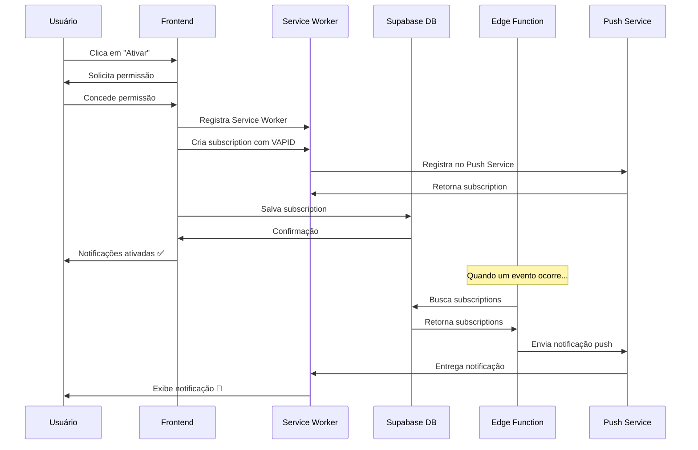

# Configuração de Notificações Push - SIGE

## Visão Geral
O sistema de notificações push do SIGE utiliza o protocolo Web Push com chaves VAPID para garantir segurança e privacidade.

## Passo a Passo para Configuração

### 1. Gerar Chaves VAPID

Execute o seguinte comando no terminal:

```bash
npx web-push generate-vapid-keys
```

Você receberá duas chaves:
- **Public Key** (chave pública) - segura para ser exposta no cliente
- **Private Key** (chave privada) - DEVE permanecer secreta no servidor

### 2. Adicionar as Chaves no Projeto

#### 2.1 Adicionar Chave Pública no `.env`

Crie ou edite o arquivo `.env` na raiz do projeto e adicione:

```env
VITE_VAPID_PUBLIC_KEY=sua_chave_publica_aqui
```

**Exemplo:**
```env
VITE_VAPID_PUBLIC_KEY=BNxJxP6TzOskXXXXXXXXXXXXXXXXXXXXXXXXXXXXXXXXXXXXXXXX
```

#### 2.2 Adicionar Chave Privada no Supabase

As chaves privadas já foram configuradas como secrets no Supabase:
- `VAPID_PUBLIC_KEY` - Já configurada ✅
- `VAPID_PRIVATE_KEY` - Já configurada ✅

**Para atualizar os valores:**
1. Acesse o [Supabase Dashboard](https://supabase.com/dashboard/project/atogozlqfwxztjyycjoy/settings/functions)
2. Vá em Settings > Edge Functions
3. Atualize os valores de `VAPID_PUBLIC_KEY` e `VAPID_PRIVATE_KEY`

### 3. Configurar a Edge Function

A edge function `send-push-notification` já está configurada para usar os secrets VAPID no arquivo `supabase/config.toml`.

### 4. Testar as Notificações

1. **Acesse a página de Configurações** (`/app/configuracoes`)
2. **Navegue até a aba "Notificações"**
3. **Clique em "Ativar Notificações"**
4. **Permita notificações** quando o navegador solicitar
5. **Clique em "Enviar Teste"** para verificar se está funcionando

## Fluxo de Funcionamento



## Tipos de Notificações

O sistema suporta os seguintes tipos de notificações:

### Eventos
- ✅ Lembretes de eventos (24h/48h antes)
- ✅ Atualizações de status de eventos
- ✅ Criação de novos eventos

### Pessoal
- ✅ Atualizações de alocações
- ✅ Alertas de ausências

### Pagamentos
- ✅ Lembretes de pagamentos
- ✅ Confirmação de pagamentos recebidos

### Sistema
- ✅ Convites de equipe
- ✅ Mudanças de status

## Logs e Debugging

Para verificar os logs da edge function:
1. Acesse [Supabase Edge Function Logs](https://supabase.com/dashboard/project/atogozlqfwxztjyycjoy/functions/send-push-notification/logs)
2. Verifique erros de conexão com o Push Service
3. Confirme que as VAPID keys estão corretas

## Troubleshooting

### Erro: "Falha ao ativar notificações"

**Possíveis causas:**
1. VAPID keys não configuradas
2. Service Worker não registrado
3. Navegador não suporta push notifications
4. Permissão negada pelo usuário

**Soluções:**
1. Verifique se as keys VAPID estão no `.env`
2. Reinicie o servidor de desenvolvimento
3. Limpe o cache do navegador
4. Teste em um navegador diferente (Chrome/Edge recomendados)

### Erro: "VAPID keys não foram configuradas"

**Solução:**
1. Execute `npx web-push generate-vapid-keys`
2. Adicione a chave pública no `.env`
3. Adicione a chave privada nos Supabase Secrets
4. Reinicie o servidor

### Notificações não chegam

**Verifique:**
1. Se a subscription foi salva no banco de dados
2. Se a edge function está sendo chamada
3. Se os logs da edge function mostram algum erro
4. Se o navegador permite notificações do site

## Compatibilidade de Navegadores

| Navegador | Suporte | Notas |
|-----------|---------|-------|
| Chrome | ✅ Sim | Recomendado |
| Edge | ✅ Sim | Recomendado |
| Firefox | ✅ Sim | Funcional |
| Safari | ⚠️ Parcial | Requer HTTPS |
| Opera | ✅ Sim | Funcional |

## Segurança

- ✅ Chaves VAPID protegem contra spam
- ✅ Subscription é única por dispositivo
- ✅ Chave privada nunca é exposta no cliente
- ✅ HTTPS obrigatório em produção
- ✅ RLS policies protegem dados de subscription

## Próximos Passos

Para testar em produção:
1. Configure as VAPID keys no ambiente de produção
2. Certifique-se de que o site está em HTTPS
3. Deploy da edge function
4. Teste com múltiplos usuários e dispositivos
